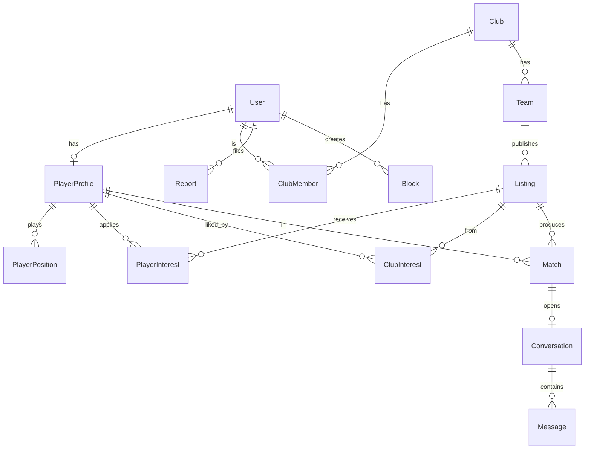

# Cadrage projet — App de mise en relation joueurs ⇄ clubs (football suisse)

> **Document de référence définitif pour Claude Code.**
> Toutes les décisions ci-dessous sont **arrêtées**. Ne pas dévier sans instruction explicite.
> Fichiers compagnons : `schema.prisma` (modèle de données) et `nomenclature_football_suisse.json` (données de référence : ligues, catégories, postes).

---

## 0. Identité du projet

- **Nom : FootLink**
- **Domaine : footlink.ch** (à réserver ; App Store / Play Store à vérifier avant dépôt).
- **Bundle identifier iOS / package Android : `ch.footlink.app`**
- **Scheme / deep links : `footlink://`**

---

## 1. Vision & contexte

Application mobile de **mise en relation entre joueurs de football amateur et clubs**, façon **« LinkedIn × Tinder »** :

- **LinkedIn** pour le sérieux : profils riches, parcours, crédibilité.
- **Tinder / jobup** pour le moteur : intérêt, candidatures, match, discussion.

**Problème résolu :** un joueur (ex. un gardien) ne sait pas quels clubs cherchent quelqu'un à son poste, ni pour quelle équipe (juniors A–G, actifs 2e–5e ligue). Les clubs ne savent pas quels joueurs sont disponibles. L'app connecte les deux.

**Déploiement géographique :**

- **Phase 1 (MVP)** : Valais uniquement (association AVF).
- **Phase 2** : Suisse entière (13 associations régionales). L'architecture doit être **prête** pour cette extension dès le départ (régions, i18n, géoloc).

**Point produit n°1 : l'UI/UX.** L'expérience doit provoquer un « effet WOW » immédiat — fluidité 60 fps, animations soignées, sensation premium. C'est le critère de qualité prioritaire, au-dessus du volume de fonctionnalités.

---

## 2. Stack technique (verrouillée)

### Mobile (iOS + Android, un seul codebase)

- **React Native + Expo** (managed workflow), **TypeScript**.
- **EAS Build** pour compiler les binaires App Store / Play Store (pas de Xcode/Android Studio à gérer manuellement).
- **EAS Update** pour les mises à jour **OTA** (over-the-air) du bundle JS.
- **Expo Router** pour la navigation.
- **Expo Notifications** pour les push.
- **expo-localization** pour la langue de l'appareil.

### Animations & UI (prioritaire)

- **React Native Reanimated 3** — animations sur le thread UI, 60 fps.
- **React Native Gesture Handler** — gestes natifs (deck de swipe).
- **Moti** — transitions déclaratives sur Reanimated.
- **Lottie** (`lottie-react-native`) — moments « waouh » (célébration de match, etc.).
- **Expo Image** — chargement d'images avec placeholder flou (blurhash).
- **FlashList** (Shopify) — listes performantes.
- **Style : Tamagui** (thèmes light/dark, animations intégrées, performant). *(Décision arrêtée : Tamagui plutôt que NativeWind pour le rendu premium.)*

### Backend

- **Node.js + NestJS**, **TypeScript**.
- **API REST versionnée** (`/api/v1/...`) via le versioning natif NestJS.
- **WebSockets** (gateway NestJS + Socket.IO) pour la messagerie temps réel.
- **Auth : JWT** (access token court + refresh token en base, hashé). **Deux modes d'inscription/connexion : (a) email + mot de passe _avec validation de l'email_, ou (b) Google Sign-In** (jeton Google vérifié côté serveur). Reset mot de passe + invitation entraîneur par email (Gmail SMTP + app password au MVP).
- **ORM : Prisma** sur **MySQL 8** (voir `schema.prisma`).

### Back-office admin (POST-MVP)

- **Non inclus dans le MVP.** Prévu ensuite : application **web séparée** (React + Vite), même API (`/api/v1/admin/...`), réservée au rôle `SUPER_ADMIN`. Au MVP, les signalements se consultent directement en base.

### Régions / associations (extension nationale)

- Départ : **AVF (Valais) uniquement**. L'association régionale est une **table de référence `Region`** (seedée depuis le JSON), **rattachée au club uniquement** (`Club.regionCode`). Un **joueur n'est PAS rattaché à une région** : il reste trouvable au-delà de son canton via la **recherche géographique par rayon** (un joueur proche de la frontière VD/VS est visible côté Vaud comme côté Valais). Ajouter une nouvelle association (Vaud, Genève, etc.) = **insérer une ligne** en base, **aucune modification de code**. Voir `regions_associations` dans le JSON de nomenclature.

### Stockage & médias

- **Photos de profil / logos** sur stockage **compatible S3**.
- **Recommandation : Cloudflare R2 ou Backblaze B2** (tier gratuit généreux, zéro frais d'egress). Le code utilise le **SDK S3 standard** — on change juste l'endpoint. Uploads via **URL pré-signées** (le mobile upload directement, le backend ne relaie pas les fichiers).

### Infrastructure & déploiement

- **VPS déjà loué**, **sans Docker** au départ (dockerisable plus tard sans changer le code).
- **Node géré par PM2** (redémarrage auto, logs, mode cluster).
- **Nginx** en reverse proxy + **HTTPS via Certbot / Let's Encrypt**.
- **MySQL 8 installé directement** sur le VPS.
- **Migrations via Prisma Migrate.**

---

## 3. Périmètre du MVP

### Inclus

- Inscription / connexion : **email + mot de passe (avec validation email)** _ou_ **Google Sign-In**, JWT (access court + refresh hashé).
- Profil **joueur** complet (poste principal + secondaires, année de naissance, pied fort, taille, catégorie/club actuels masquables, localisation approximative, bio, photo).
- **Demande de compte club → validation par le SUPER_ADMIN** (voir §4bis), puis création de **comptes entraîneurs** assignés à des équipes.
- Gestion du **club** : ajout de **plusieurs équipes** (une par catégorie/genre), vision globale pour le CLUB_ADMIN, vue limitée aux équipes assignées pour le COACH.
- Publication d'**annonces** de recherche de joueur, rattachées à une équipe, avec poste recherché.
- **Interactions** : le joueur postule / enregistre une annonce ; le club « like » un joueur. Intérêt **visible sans réciprocité**.
- **Match** sur intérêt réciproque → **messagerie temps réel** in-app.
- Statut joueur **« je cherche un club »** (`isSeekingClub`).
- **Notifications push** (nouvel intérêt, nouveau match, nouveau message).
- **Recherche / matching** par poste + catégorie + rayon géographique.
- **Signalement + blocage** côté client (motifs préremplis + commentaire libre optionnel). Les signalements sont **stockés en base** (consultables directement en DB au MVP).
- **i18n FR + DE**, langue = celle du téléphone (repli FR).

### Exclu du MVP (roadmap ultérieure)

- Vidéos / highlights (prévu plus tard).
- **Back-office admin web** (rôle `SUPER_ADMIN` existe déjà en base ; l'interface est post-MVP — au MVP, les signalements se consultent directement en base).
- Validation d'identité des clubs (`Club.verified` existe déjà, activé plus tard).
- Ouverture aux **catégories mineures < 16 ans** (modèle de données prêt, non activé).
- Statistiques joueurs, paiement / abonnement clubs (monétisation = plus tard, gratuit au lancement).
- 3e langue (IT) — enum prêt, non activée.
- **Activité hors mercato / engagement inter-fenêtres** — écarté du périmètre actuel, à réétudier plus tard.
- **Mode « renfort ponctuel / dépannage » — ABANDONNÉ (ne pas implémenter).** Un joueur licencié dans un club ne peut pas jouer pour un autre : le concept n'a pas de validité réglementaire. Ce statut/mode **ne doit pas exister** dans l'app.

---

## 4. Rôles & accès

- **PLAYER** — inscription **libre**. Crée/gère son profil joueur, postule/enregistre des annonces, répond aux intérêts des clubs, discute.
- **CLUB_ADMIN** (compte « club ») — **créé sur validation** (voir §4bis). A la **vision globale** sur toutes les équipes du club, crée/supprime les **comptes entraîneurs** et les assigne à des équipes. Dispose de **deux vues avec un toggle** :
  - **Vue Supervision** (par défaut) : dashboard global (équipes, annonces, membres). Il n'apparaît **pas** dans les conversations depuis cette vue.
  - **Vue Entraîneur** : il bascule dans **n'importe quelle équipe** de son club et y agit avec **les mêmes droits qu'un entraîneur** (gérer les annonces, le recrutement et **les conversations de cette équipe**). C'est le seul cas où il rejoint une conversation.
- **COACH** (entraîneur) — **créé par un CLUB_ADMIN**, **limité aux équipes qui lui sont assignées** (`CoachTeamAssignment`). Peut être assigné à **plusieurs équipes** et doit pouvoir **basculer d'une équipe à l'autre** dans l'app (sélecteur d'« équipe active » ; toute l'UI de gestion/annonces/recrutement s'applique à l'équipe active sélectionnée). Gère les annonces et le recrutement de ses équipes uniquement.
- **SUPER_ADMIN** — c'est toi. Au MVP, tu **valides / refuses les demandes de club directement en base de données** et consultes les signalements en base (back-office web = post-MVP).

Un même `User` peut avoir un `PlayerProfile` **et** être membre d'un club, mais le `role` principal + le `ClubMemberRole` déterminent les permissions.

## 4bis. Flux de validation des clubs (nouveau — MVP)

1. Un responsable de club **soumet une demande** de compte club (nom du club, email de contact, note/contexte). → `Club.status = PENDING`, création du `User` demandeur en `CLUB_ADMIN` + `ClubMember(isOwner = true)`.
2. Le **SUPER_ADMIN valide** (ou refuse). → `Club.status = APPROVED` (ou `REJECTED`), `reviewedAt` renseigné.
3. Tant que le club n'est **pas `APPROVED`**, il ne peut **rien publier** ni créer d'entraîneur (garde d'accès sur toutes les actions club).
4. Une fois validé, le **CLUB_ADMIN crée des comptes entraîneurs** et les **assigne à une ou plusieurs équipes**. L'entraîneur reçoit ses accès (email d'invitation).

> Conséquence produit : **seuls des clubs/entraîneurs validés** existent dans l'app → règle nativement le problème d'anti-fake côté club. La validation d'identité approfondie (`Club.verified`) reste une couche optionnelle ultérieure.

---

## 5. Modèle de données

Le schéma complet fait foi : **`schema.prisma`**. Points clés :

- `User` (auth, rôle, locale, pushToken) ↔ `PlayerProfile` (1-1) et `ClubMember` (n-n vers `Club`).
- `Club` → `Team[]` (une équipe = une `CategoryCode` + `Gender`) → `Listing[]` (annonces).
- Interactions : `PlayerInterest` (joueur→annonce, `APPLIED`|`SAVED`), `ClubInterest` (club→joueur), `Match` (réciprocité), `Conversation`/`Message`.
- Modération : `Report`, `Block`.
- **Ajouts (décisions validées)** : `Region` (table de réf. seedée, rattachée au **club uniquement** — un joueur reste trouvable inter-régions via la géoloc) · `Token` (vérif email / reset / invitation coach, **hashés, usage unique**) · `Notification` (in-app + push) · `ConversationRead` (suivi de lecture **par utilisateur**, multilecture). Côté `User` : `passwordHash` **optionnel** + `googleId` (Google Sign-In).

**Règle catégorie/âge (critique) :** les catégories juniors sont définies par **classe d'âge (U-XX)**, et la correspondance **année de naissance → catégorie change chaque saison**. On stocke `birthYear` + `currentCategory`, et une **fonction utilitaire** calcule la ou les catégories éligibles pour une saison donnée. Ne jamais coder en dur une année de naissance dans une catégorie.

**Diagramme relationnel (Mermaid) :**

---

## 6. Règles métier

### 6.1 Interactions & match (cœur du produit)

Trois actions distinctes côté **joueur** sur une annonce (`PlayerInterest.kind` + like retour) :

1. **Postuler** (`APPLIED`) → candidature active, le **club est notifié**.
2. **Enregistrer** (`SAVED`) → bookmark **privé**, personne n'est notifié.
3. **Liker en retour** → réponse à un club qui s'est déjà déclaré intéressé (déclenche le match).

Côté **club** : « liker » un joueur pour une annonce (`ClubInterest`) → le **joueur est notifié** « un club s'intéresse à toi », **sans réciprocité requise** pour voir cet intérêt.

**Création du Match :** dès qu'il existe un intérêt **des deux côtés** sur la même paire `(listing, player)` — c.-à-d. un `PlayerInterest.APPLIED` **et** un `ClubInterest` — la logique métier crée un `Match` (unique par `(listingId, playerId)`) et ouvre une `Conversation`. Le like « en retour » d'un joueur déjà liké par un club revient à créer le `PlayerInterest.APPLIED` manquant → match immédiat.

> Un `SAVED` seul **ne déclenche jamais** de notification ni de match.

### 6.2 Vue club

Le dashboard club affiche, **par équipe**, la liste de tous les joueurs en interaction (postulants + likés en retour + statut), avec filtre par équipe. Le club voit d'un coup d'œil qui est réellement en contact pour chaque équipe.

### 6.3 Discrétion / confidentialité

- `PlayerProfile.hideCurrentClub` masque le club actuel du joueur (il ne veut pas que son club actuel sache qu'il cherche).
- `PlayerProfile.isVisible` = interrupteur global de visibilité.
- `PlayerProfile.isSeekingClub` = « je cherche un club ».

### 6.4 Mineurs

- **MVP : autorisé si `birthYear ≤ (année de la saison en cours − 16)`** (≈ 16 ans et plus). En dessous, inscription joueur bloquée avec message explicite.
- Les **16–17 ans** restent juridiquement mineurs → on positionne `isMinor = true` pour eux (pour d'éventuelles règles LPD ultérieures), mais ils **peuvent** utiliser l'app. **MVP : aucun tuteur requis** — `guardianName`/`guardianEmail` restent **optionnels et inutilisés** (le flux tuteur est repoussé à l'ouverture des < 16 ans).
- Le modèle est **prêt** pour ouvrir plus tard les catégories plus jeunes : `isMinor`, `guardianName`, `guardianEmail`. Futur flux mineur = profil créé/contrôlé par un adulte, contact via le tuteur, pas de démarchage libre.
- **Conformité LPD suisse** à solidifier avant toute ouverture aux moins de 16 ans (consentement parental, minimisation des données).

### 6.5 Géolocalisation

- Stockage d'une **position approximative arrondie à ~1 km** (jamais la position GPS brute du téléphone) : on arrondit lat/lng sur une grille ~1 km avant enregistrement, en `Decimal(9,6)` + champ `canton`.
- Recherche par **rayon en km** via requête **SQL raw (formule haversine)** — Prisma ne gère pas le type spatial MySQL nativement. Encapsuler dans un service dédié.
- Le champ **`canton`/région** est conservé en parallèle pour les autres types de matching et l'affichage, et prépare l'extension nationale.

### 6.6 Annonces & saison

- `Listing.status` : `DRAFT` / `ACTIVE` / `EXPIRED` / `CLOSED`.
- `Listing.season` (ex. `"2026/2027"`) + `expiresAt` optionnel. Une tâche planifiée passe les annonces échues en `EXPIRED`.
- **Timing produit** : viser un lancement aligné sur une **fenêtre de mercato amateur** (mercato d'hiver ~déc.–févr., cohérent avec l'horizon « prêt cet hiver »).

### 6.7 Modération (MVP côté client uniquement)

- **Signaler** un utilisateur (`Report`) : l'utilisateur choisit un **motif prérempli** (`ReportReason` : faux profil, harcèlement, comportement inapproprié, contenu offensant, spam, arnaque, autre) et peut ajouter un **commentaire libre optionnel**. Le signalement est **enregistré en base** (`status = OPEN`) et consultable directement en DB au MVP.
- **Bloquer** un utilisateur (`Block`) : mêmes motifs préremplis (optionnels) + commentaire optionnel. Effet : plus aucune visibilité ni contact mutuel → **filtrer les blocages dans TOUTES les requêtes** de listing/feed/match/messagerie (dans les deux sens).
- **Back-office admin = post-MVP.** Le rôle `SUPER_ADMIN` et le modèle sont en place ; l'interface web de gestion viendra après.

### 6.8 Messagerie & permissions (côté club)

- **Une conversation appartient à l'équipe** liée à l'annonce/au match. Côté club, **seul(s) le(s) entraîneur(s) assigné(s) à cette équipe** en sont participants et peuvent répondre.
- Le **CLUB_ADMIN** ne voit pas les conversations depuis sa **Vue Supervision** ; il n'y accède qu'en basculant en **Vue Entraîneur** sur l'équipe concernée (voir §4).
- Permissions résumées : **COACH** = agit uniquement sur ses équipes assignées (`CoachTeamAssignment`). **CLUB_ADMIN** = agit sur **toutes** les équipes de son club (sans assignation, via le toggle), en plus de la gestion des comptes/équipes.
- *(Aucun changement de schéma requis : ces règles sont des gardes d'accès applicatives ; `Message.senderUserId` référence l'utilisateur club autorisé qui répond.)*

---

## 7. Parcours utilisateurs clés

**Joueur :** inscription → onboarding profil (poste, catégorie, localisation, photo) → feed d'annonces filtrées (poste + catégorie + rayon) → postuler / enregistrer / voir les clubs intéressés → match → discussion.

**Club :** inscription → création du club → ajout des équipes → publication d'annonces → feed de joueurs correspondant à chaque annonce → liker → voir les candidats par équipe → match → discussion.

---

## 8. Compatibilité des versions d'app (exigence forte)

Les utilisateurs ne mettent pas tous à jour en même temps. Trois mécanismes combinés :

1. **EAS Update (OTA)** — les changements JS sont poussés sans passer par les stores ; la majorité des évolutions atteignent tout le monde en minutes.
2. **API versionnée** (`/api/v1/`) — on ne **casse jamais** une version en prod. Changements **additifs uniquement** (champs optionnels). Rupture inévitable → nouvelle version `/api/v2/`, l'ancienne continue de tourner.
3. **Gate de version minimale** — au lancement, l'app interroge un endpoint (`GET /api/v1/app/config`) renvoyant la version minimale supportée ; si l'app installée est trop ancienne (uniquement en cas de changement natif incompatible), écran bloquant « Mets à jour pour continuer ».

---

## 9. Internationalisation

- Langues **actives : FR, DE**. Enum prévoit **IT** (non activé).
- Langue par défaut = **langue du téléphone** (`expo-localization`), **repli FR** si ni FR ni DE.
- Tous les libellés d'UI passent par des **clés i18n** dès le départ. Les données de référence (nomenclature) portent `label_fr` / `label_de`.
- Côté backend, les messages destinés à l'utilisateur (emails, push) tiennent compte de `User.locale`.

---

## 10. Sécurité & conformité — PRIORITÉ CRITIQUE (au même niveau que l'UI/UX)

**Règle d'or : isolation stricte des comptes et des données. Un utilisateur ne doit JAMAIS pouvoir se connecter au compte d'un autre, ni accéder à des données sans être authentifié et autorisé.**

- **Impossible de se connecter/usurper le compte d'autrui.** Auth robuste, jetons signés (secrets forts), pas de fuite de session.
- **Aucune donnée accessible sans authentification** : hors endpoints publics explicites (inscription/connexion, `GET /api/v1/app/config`), **toute** requête exige un JWT valide.
- **Autorisation vérifiée sur CHAQUE ressource (anti-IDOR)** : ne **jamais** faire confiance à un ID fourni par le client. Toujours vérifier que le demandeur possède/gère la ressource — joueur = **son** profil ; coach = **ses** équipes assignées (`CoachTeamAssignment`) ; club_admin = **son** club ; super_admin = global. Un utilisateur ne lit/modifie jamais les données d'un autre.
- Mots de passe hashés **argon2**. Refresh tokens **et** jetons email (vérif / reset / invitation coach) **hashés en base**, à **usage unique**, **TTL court** ; jamais stockés ni logués en clair.
- **Google Sign-In** : jeton Google **vérifié côté serveur** (signature + audience) ; aucune confiance au client.
- **Filtrage systématique des blocages/suspensions** dans **TOUTES** les requêtes (feed, match, messagerie, dans les deux sens).
- URL pré-signées à durée courte + **validation type/taille** pour les uploads médias.
- Validation stricte des entrées (DTO + class-validator) ; **pas de mass-assignment** ; **rate-limiting** sur les endpoints d'auth.
- **Secrets uniquement dans `.env` (gitignored)**, jamais commités ; ne jamais loguer mots de passe / jetons / secrets.
- **LPD suisse** : minimisation des données, droit à l'effacement (`UserStatus.DELETED` + purge), position approximative (~1 km) uniquement — **jamais le GPS brut**.

---

## 11. Roadmap post-MVP (pour info, ne pas implémenter maintenant)

Extension Suisse entière (13 associations, IT) · validation d'identité des clubs · ouverture encadrée aux mineurs · vidéos/highlights · statistiques joueurs · monétisation (annonces payantes / premium club).

---

## 12. Conventions

- **TypeScript strict** partout, front et back.
- Nommage des **codes de référence** aligné sur `nomenclature_football_suisse.json` et sur les enums `schema.prisma` (source unique de vérité).
- Structure backend NestJS **modulaire** : un module par domaine (`auth`, `users`, `players`, `clubs`, `teams`, `listings`, `interactions`, `matches`, `messaging`, `moderation`, `geo`, `notifications`). *(Module `admin` = post-MVP.)*
- Structure mobile par **feature** (folders `features/<domaine>`), composants UI partagés dans `ui/`.
- Seed de la base à partir du JSON de nomenclature pour les données de référence.

---

## 13. Saisonnalité (hors périmètre pour l'instant)

La question de l'activité **hors périodes de mercato** est **repoussée** : on ne cherche pas à la traiter maintenant, elle sera réétudiée plus tard. Aucune fonctionnalité dédiée dans le périmètre actuel.

**À ne pas implémenter :** le mode « renfort ponctuel / dépannage » est **abandonné** (un joueur licencié dans un club ne peut pas jouer pour un autre — pas de validité réglementaire). Ce concept **ne doit exister nulle part** dans l'app.
